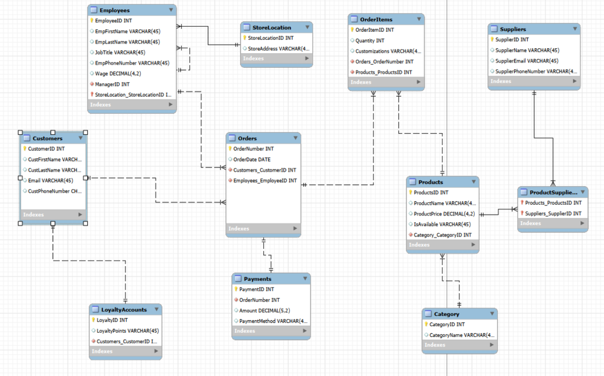
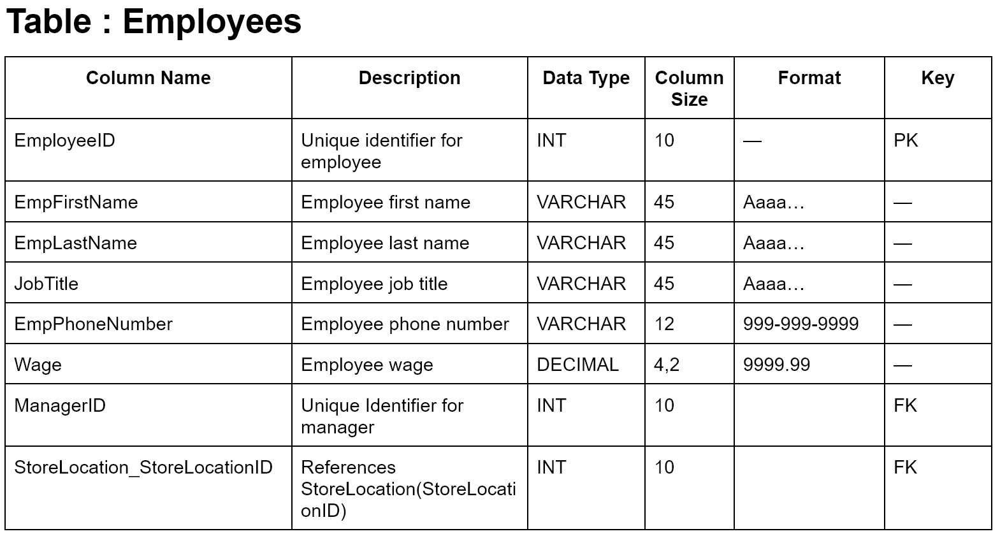
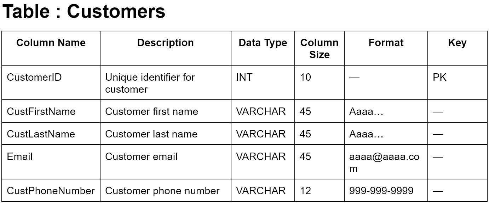
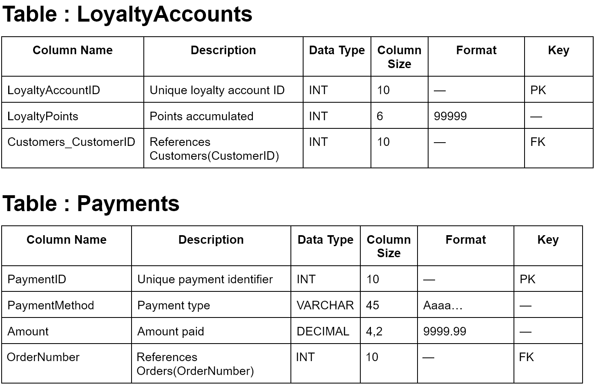
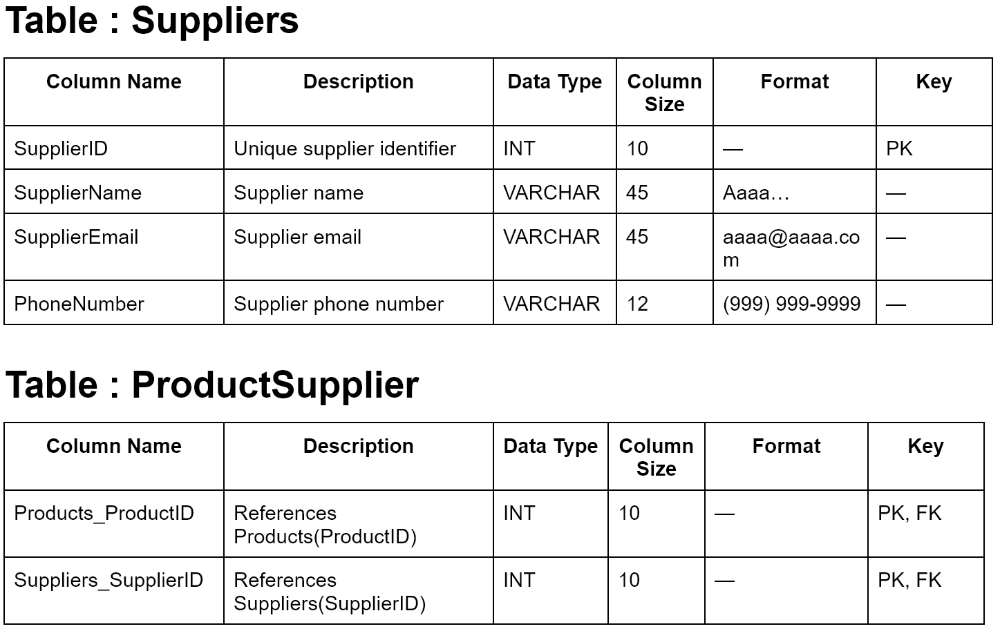
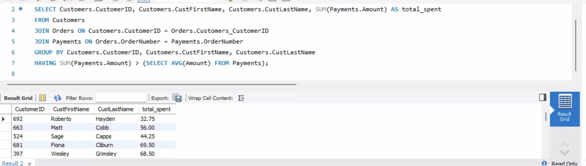
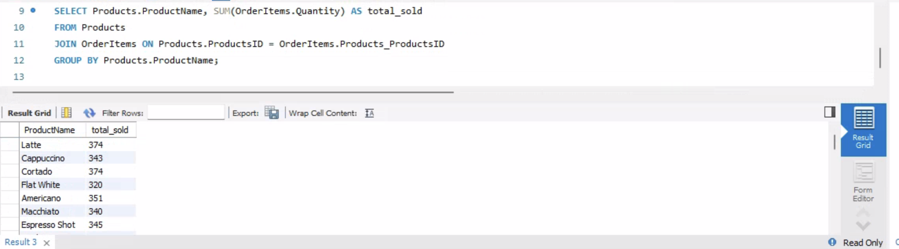

# MIST 4610 Group Project 1 - Group 7

## Group Members:

1. Donovan D'Silva - 	[repo](https://github.com/donmelsil/MIST4610_Group-Project)
2. Noah Hammond	-[repo](https://github.com/NoahHammond1/MIST4610_CoffeeShop_Project)
3. Chase Lin - [repo](https://github.com/cinnamotz/mist4610gp1)
4. Krithin Lokasani	- [repo](https://github.com/lokasanikrithin-source/GP1MIST2610)
5. Jessica Ngo -[repo](https://github.com/jn83499/Mist4610_Group-Project)

## Problem Description
We were assigned a task to model and build a relational database for the general operations of a coffee shop. The central entity in the model is the Orders entity, as it represents each transaction made by customers and serves as the core around which the rest of the system operates. Orders connect key components of the business, including customers, employees, products, and payments.

The coffee shop operates with related entities such as products (menu items), suppliers, and loyalty accounts, all supporting daily operations. Suppliers provide the necessary ingredients and inventory, while customer and order data allow the business to track consumer behavior and service interactions.

We are interested in accurately modeling these relationships, generating sample data, and populating the entities and their attributes. We aim to perform functional queries on this data to provide important and valuable business insights, such as identifying popular menu items, managing inventory needs, and supporting decision-making for purchasing and operational efficiency.
## Data Model
## Data Model
Our model is based on the structure of a hypothetical chain/franchised coffee shop. The orders entity serves as the central part of the system, since it represents each and every transaction made by customers and connects it to multiple entities including employees, products, and payments.

Within the system there are many customers who place orders, and each customer can place multiple orders over time, establishing a one to many relationship between customers and orders entities. Similarly, the coffee shop employs many employees who handle transactions. Each employee can process multiple orders, but each order is handled by a single employee. We identify this relationship as a one to many relationship between Employees and Orders. There also includes a recursive relationship to represent management structure within the coffee shop. Each employee reports to a manager, which is also another employee in the system. We use the ManagerId attribute, which also references the EmployeeID within the same table. As a result this creates a one to many recursive relationship where one manager can supervise multiple employees and each employee reports to only one manager.

We also have a StoreLocation entity that represents the physical coffee shop locations where each location employs many employees but employees are only able to work at a single location. Hence why we created a one to many relationship between StoreLocation and Employees. Orders then breaks down into individual items through OrderItems, acting as an associative entity between Orders and Products. Each order can contain multiple products like drinks and pastries, and then each product can appear in multiple different orders. Because of this, we identify this as a many to many relationship between Orders and Products, and the OrderItems table is used to store details like price, quantity and customizations for each product. This creates a one to many relationship between Orders and OrderItems and a one to many relationship between Products and OrderItems.

The products entity stores all of the items solid by the coffee chain, things like beverages and food. Each product is then assigned to a category, like tea, coffee, pastries, and each category can contain multiple products. This establishes a one to many relationship between category and products, which help in organizing inventory and simplify reporting. Products are then supplied to by external suppliers, and this relationship would be many to many, because a single supplier can provide multiple products and a product can come from multiple suppliers. To solve this, the model uses an associative entity named ProductSupplier, creating two one to many relationships, one between Suppliers and ProductSupplier and another between Products and ProductSupplier.

The model then tracks financial transactions through Payments. Each order is associated with a PaymentID, allowing the system to track how and when transactions are completed. This creates a one to one relationship between Orders and Payments since every Order can only take one payment.

Finally, the coffee chain includes a Loyalty program, which we decided to display through a LoyaltyAccounts entity to manage the customer reward system. Each customer can have one loyalty account, and each loyalty account belongs to a single customer, forming a one to one relationship. This allows both the business and customer to track points and rewards, and specifically for the business to repeat and improve upon customer engagement.

Overall, the data model supports the core function and operations of a local coffee chain by organizing between customers, employees, products, suppliers, and transactions. It ensures the business has a database that can effectively track sales, manage inventory, track consumer behavior and support loyalty programs.

## Data Dictionary

## Queries
| Feature                     | Q1 | Q2 | Q3 | Q4 | Q5 | Q6 | Q7 | Q8 | Q9 | Q10 |
|----------------------------|----|----|----|----|----|----|----|----|----|-----|
| Multiple Table Join        | X  | X  |    |    |    |    |    |    |    |     |
| Subquery                   | X  |    |    |    |    |    |    |    |    |     |
| GROUP BY                   | X  | X  |    |    |    |    |    |    |    |     |
| GROUP BY with HAVING       | X  |    |    |    |    |    |    |    |    |     |
| Multi-condition WHERE      |    |    |    |    |    |    |    |    |    |     |
| Built-in Functions         | X  | X  |    |    |    |    |    |    |    |     |
| REGEXP                     |    |    |    |    |    |    |    |    |    |     |
| NOT EXISTS                 |    |    |    |    |    |    |    |    |    |     |
1. Query 1 finds customers whose total spending is greater than the average order total. It joins customers, orders, and payments to calculate how much each customer has spent in total. It then compares each customer’s total spending to the average payment amount across all payment and shows the customers whose total spending is greater than that average.

Query 1 allows managers to identify the customers who spend the most, helping them focus on high-value customers. This allows them to create targeted promotions, loyalty rewards, and upselling strategies to increase revenue. It also helps them make smarter business decisions by understanding customer spending patterns.

2. Query 2 adds up the quantity sold for each product and groups the results by product name so you can see the total units sold for each individual product.

Query 2 allows managers to see which items are popular so they know what to restock more and what might not be selling well. This helps identify top-performing items which can guide decisions like which products to restock more or promote. It also helps with inventory planning and forecasting demand, so they don’t overstock slow items or run out of popular ones.
## Database information
Name of Database: al_Group_21482_G7
Additional Info: Each query listed above is marked in the database used stored procedures which are called through the following format: CALL TP_Q() where "()" is the query number.
